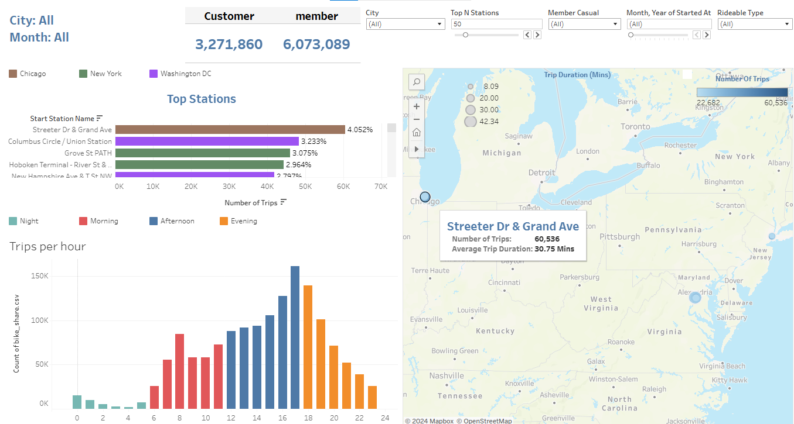
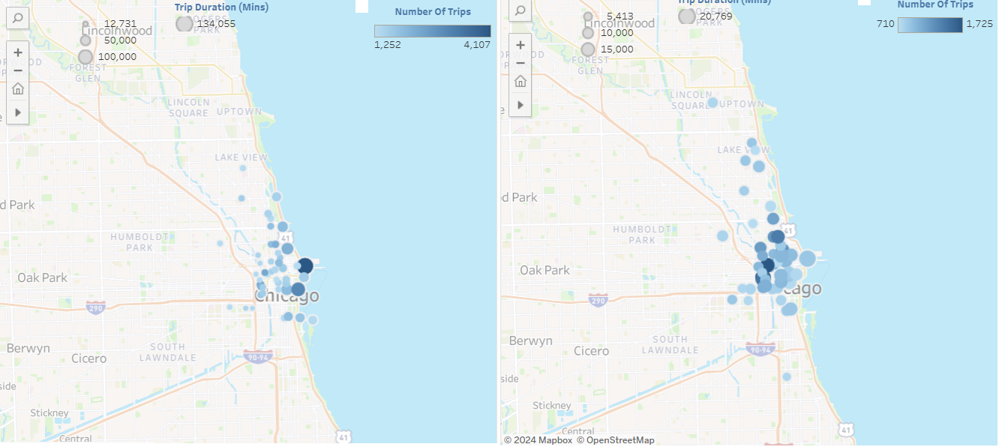
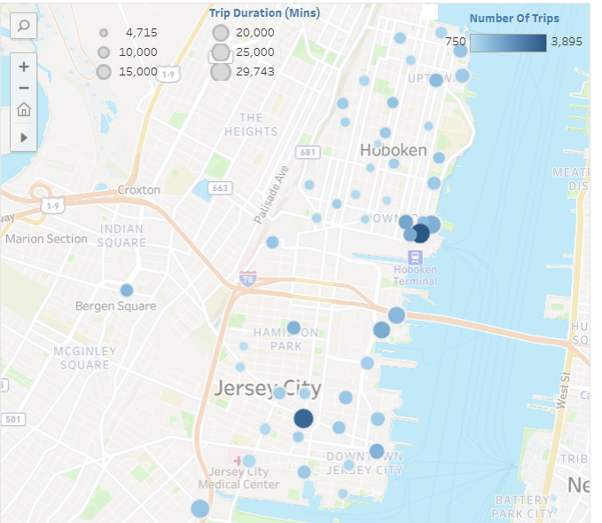
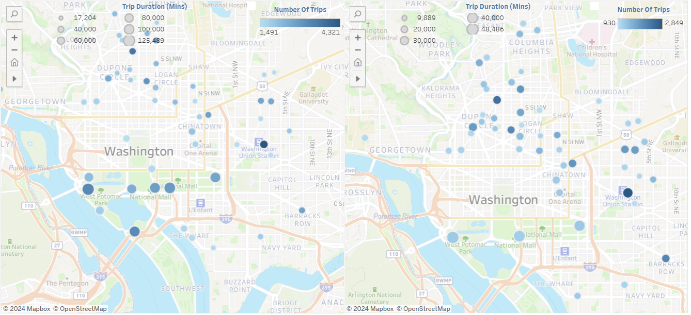
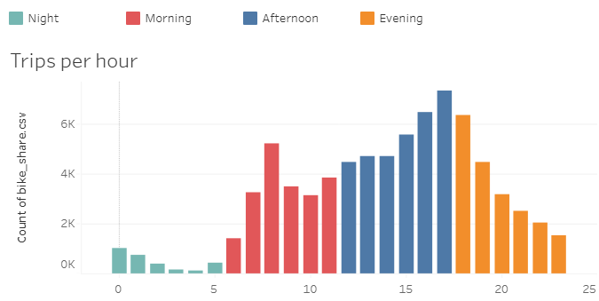

# 🚲 Bike-Sharing Dataset Investigation

This repository leverages the Data Analysis Process on bike-sharing datasets collected from three different companies in the United States over the last 12 months (May 2023 - April 2024).

## 📑 Table of Contents
- [Overview of the Data](#overview)
- [Data Wrangling](#wrangling)
- [Insights](#insights)

## 📊 Overview of the Data

This project includes three datasets sourced from three distinct companies:

1. **Divvy** - Chicago, Illinois

   

   Divvy is Chicagoland’s bike share system covering Chicago and Evanston. It offers monthly bike trip datasets for public use, accessible [here](https://divvybikes.com/system-data).

2. **Citi Bike** - New York City, New York

   

   Citi Bike is a privately owned public bicycle sharing system serving the New York City boroughs of the Bronx, Brooklyn, Manhattan, and Queens, as well as Jersey City, New Jersey. Monthly bike trip datasets are available [here](https://www.citibikenyc.com/system-data).

3. **Capital Bikeshare** - Washington, D.C.

   

   Capital Bikeshare serves Washington, D.C. and Arlington County, Virginia. The datasets of bike trips can be accessed [here](https://www.capitalbikeshare.com/system-data).

The data provided by these companies has become consistent in recent years, featuring the following columns:

- `ride_id`: Unique identifier for each ride
- `rideable_type`: Type of bike used for the ride
- `started_at`: Date and time when the ride started
- `ended_at`: Date and time when the ride ended
- `start_station_name`: Name of the station where the ride started
- `start_station_id`: Unique identifier for the station where the ride started
- `end_station_name`: Name of the station where the ride ended
- `end_station_id`: Unique identifier for the station where the ride ended
- `start_lat`: Latitude of the station where the ride started
- `start_lng`: Longitude of the station where the ride started
- `end_lat`: Latitude of the station where the ride ended
- `end_lng`: Longitude of the station where the ride ended
- `member_casual`: Type of user for the ride, member for users with a membership, casual for users without a membership

## 🛠️ Data Wrangling

The data wrangling process, detailed in the `wrangle_data.py` file, involves:

1. **Data Collection**: Gathering data from the respective company websites.
2. **Data Assessment**: Evaluating data types, missing values, duplicates, etc., and identifying issues for cleaning.
3. **Data Cleaning**: Addressing identified issues, including:
   - Dropping irrelevant columns
   - Fixing data types
   - Removing outliers
   - Handling missing values
   - Unifying station coordinates for further analysis
   - Combining the three datasets into one comprehensive dataset

## 🔍 Insights

**`Tableau`** was used to visualize the data and derive insights. The interactive dashboard can be accessed below:

The dashboard includes filters for:
- City
- Month
- User Type
- Rideable Type
- Selecting Top N Stations
- Different Hours of the Day

### 🌟 Key Insights

Here are Few examples on using the dashboard to derive insights:

- **Chicago**: As the weather warms up, the number of rides increases along the coast of Lake Michigan.
  
  
  
  *Comparison: March 2024 (left) vs. December 2023 (right)*

  Rides along the coast tend to have longer durations regardless of the month.

- **New York City**: The highest number of rides are in South Hoboken and Grove St Path.
  
  

- **Washington D.C.**: In the past winter, areas around the Potomac River, like Jefferson and Lincoln Memorial, had the highest number of rides. As the weather warmed in 2024, areas around New Hampshire gained popularity.
  
  
  
  *Comparison: Late 2023 (left) vs. early 2024 (right)*

  Similar to Chicago, ride durations are generally higher around the Potomac River regardless of the month.

- **Favorite Hours**: Peak ride times are around 8 am and between 4-6 pm.

  

Discover more insights and customize visualizations by visiting the [Dashboard!!](https://public.tableau.com/views/Bike-ShareDatasetsAnalysis/Statistics?:language=en-US&:sid=&:display_count=n&:origin=viz_share_link).
