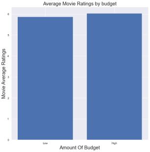

# Project: Investigate a Dataset (TMDb movie data) 🎥

## Overview 📝

This project is part of the Udacity Data Analyst Nanodegree program. The goal of this project is to apply the data analysis process to a real-world dataset and communicate the findings. The dataset chosen for this project is the TMDb movie data, which contains information about 10,000 movies collected from The Movie Database (TMDb), including user ratings and revenue.

## Dataset 📊

The dataset used for this project is the TMDb movie data, which is a CSV file that can be downloaded from [this link](https://d17h27t6h515a5.cloudfront.net/topher/2017/October/59dd2e9a_tmdb-movies/tmdb-movies.csv). The dataset contains 10,866 rows and 21 columns, each row representing a movie and each column representing a feature of the movie. The features are:
`
- `id`: The id of the movie
- `imdb_id`: The id of the movie in IMDb website
- `popularity`: The popularity score of the movie
- `budget`: The budget of the movie in US dollars
- `revenue`: The revenue of the movie in US dollars
- `original_title`: The original title of the movie
- `cast`: The cast of the movie
- `homepage`: The homepage of the movie
- `director`: The director of the movie
- `tagline`: The tagline of the movie
- `keywords`: The keywords associated with the movie
- `overview`: The overview of the movie
- `runtime`: The runtime of the movie in minutes
- `genres`: The genres of the movie
- `production_companies`: The production companies of the movie
- `release_date`: The release date of the movie
- `vote_count`: The number of votes received by the movie
- `vote_average`: The average rating of the movie
- `release_year`: The release year of the movie
- `budget_adj`: The budget of the movie adjusted for inflation in 2010 US dollars
- `revenue_adj`: The revenue of the movie adjusted for inflation in 2010 US dollars

The dataset has some quality and tidiness issues that need to be addressed before performing analysis, such as missing values, duplicates, incorrect data types, and non-relevant columns. These issues are handled in the data wrangling section.

## Research Questions ❓

The following research questions are posed to guide the analysis:

- Q1: Does the amount of budget affect the rating of a movie?
- Q2: Does the duration of a movie affect the rating?
- Q3: What are the changes of different features of movies over the years?
- Q4: What are the movies with the most gains and most losses?
- Q5: What are the different statistics of genres?

## Data Wrangling 🧹

The dataset is downloaded from [this link](https://d17h27t6h515a5.cloudfront.net/topher/2017/October/59dd2e9a_tmdb-movies/tmdb-movies.csv) and loaded into a pandas dataframe. The dataset is then assessed for quality and tidiness issues, such as missing values, duplicates, incorrect data types, and non-relevant columns. The following steps are taken to clean the dataset:

- Drop duplicates
- Drop non-relevant columns
- Drop rows with missing values
- Split genres column into multiple columns
- Create a new column for money gain (revenue - budget)

## Exploratory Data Analysis 📈 

The cleaned dataset is then explored using descriptive statistics and visualizations to answer the research questions. The following steps are taken to perform the analysis:

- Compute summary statistics and histograms for numerical variables
- Plot scatter plots to examine the relationships between budget, revenue, duration, rating, and popularity
- Group the data by movie era (60s, 70s, 80s, 90s, modern) and compare the mean values of different features over time
- Sort the data by money gain and identify the movies with the most gains and most losses
- Explode the genres column and calculate the count, mean, median, and standard deviation of different genres

## Drawing Conclusions 💡 & Communicating Results 📢 

The findings and answers to the research questions are summarized as follows:

- Q1: Does the amount of budget affect the rating of a movie?

A1: Movies with higher budget generally received higher ratings  

- Q2: Does the duration of a movie affect the rating?

A2: Movies with longer duration generally received higher ratings

- Q3: What are the changes of different features of movies over the years?
A3: Popularity, budget, revenue, and vote count of movies increased over time, while duration and ratings decreased over time

- Q4: What are the movies with the most gains and most losses? 
A4: 
   - The movies with the most gains were Avatar, Star Wars: The Force Awakens, Titanic, Jurassic World, and Furious 7. 
   
   - The movies with the most losses were The Warrior's Way, The Lone Ranger, The Wolfman, The Pacific, and Double Wedding.
   
- Q5: What are the different statistics of genres?
    - most popular genres 
    
    Adventure was the most popular genre , followed by science fiction, fantasy, ation then animation.
    - Most Profitable Genres 
    
    - Top Genres Preferences Over Decades
     
    We See That Documentaries Were The Favourite Until the 90s Then TV Movies Topped It 

## Requirements 🛠️ 

To run this project, you will need:

- Python 3.x 🐍
- Jupyter Notebook 📓
- pandas 🐼
- numpy 🔢
- matplotlib 📊
- seaborn 🎨

You can install these packages using pip or conda commands. For example:

`pip install pandas`

or

`conda install pandas`

## References 🔗 

The following sources were used for this project:

🎓 Udacity Data Analyst Nanodegree program materials 

Udacity Data Analyst Nanodegree program materials 🎓
- TMDb movie data documentation: https://developers.themoviedb.org/3/getting-started/introduction 🎬
- pandas documentation: https://pandas.pydata.org/docs/ 🐼
- numpy documentation: https://numpy.org/doc/ 🔢
- matplotlib documentation: https://matplotlib.org/stable/contents.html 📊
- seaborn documentation: https://seaborn.pydata.org/index.html 🎨
